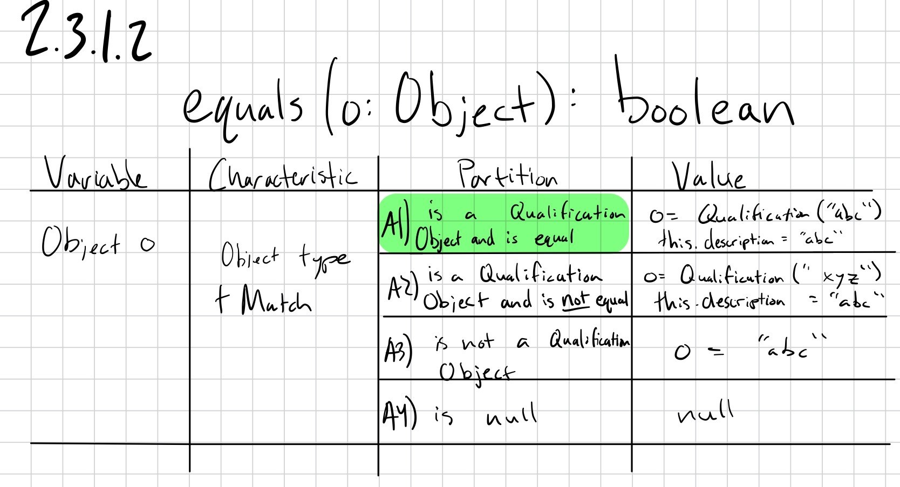

# Qualification Class
**2.3.1.1**

**2.3.1.2**

**2.3.1.3**

**2.3.1.4**

**2.3.1.5**

**2.3.1.6**

**2.3.1.7**

**2.3.1.8**

# Worker class
**2.3.2.1**

**2.3.2.2**

**2.3.2.3**

**2.3.2.4**

**2.3.2.5**

**2.3.2.6**

**2.3.2.7**

**2.3.2.8**

**2.3.2.9**

**2.3.2.10**

**2.3.2.11**

**2.3.2.12**

**2.3.2.14 Worker.willOverload() Input Space Partitioning**
|Variable|Characteristic|Partition|Value|
|---|---|---|---|
|p|A) ProjectSize|A1) SMALL|A project with a ProjectSize of SMALL.|
|||A2) MEDIUM  (Base.)|A project with a ProjectSize of MEDIUM.|
|||A3) BIG|A project with a ProjectSize of BIG.|
||B) Is or isn't null.|B1) Not null.  (Base.)|A non-null project.|
|||B2) Null.|null|
||C) Whether or not the worker is already part of the project.|C1) The worker is already part of it.|A project with the name of one in the worker's set of projects.|
|||C2) The worker is new to the project.  (Base.)|A project with a name that does not match one in the worker's set of projects.|
|The worker.|D) The worker's workload.|D1) The worker is a small project away from being overloaded.  (12)|12|
|||D2) The worker is a medium project away from being overloaded.  (11)  (Base.)|11|
|||D3) The worker is a big project away from being overloaded.  (10)|10|
|||D4) The worker is not within a project of being overloaded.  (< 10)|9|

**2.3.2.15 Worker.isAvailable() Input Space Partitioning**
|Variable|Characteristic|Partition|Value|
|---|---|---|---|
|The Worker|A) workload|A1) < 12 (Base.)|11|
|||A2) 12|12|
|||A3) > 12|13|

**2.3.2.16 Worker.toDTO() Input Space Partitioning**
|Variable|Characteristic|Partition|Value|
|---|---|---|---|
|name|A) Is or isn't null.|A1) Null.|null|
|||A2) Not null.  (Base.)|Jeff|
|salary|B) Is or isn't null.|B1) Null.|null|
|||B2) Not null.  (Base.)|83769.22|
|workload|C) Is or isn't null.|C1) Null.|null|
|||C2) Not null.  (Base.)|8|
|projects|D) Is or isn't null.|D1) Null.|null|
|||D2) Not null.  (Base.)|{"Project Distraction for Jeff"}|
||E) Size|E1) 0|0|
|||E2) > 0 (Base.)|{"Project 1", "Project 1 Enhanced"}|
|qualifications|F) Is or isn't null.|F1) Null.|null|
|||F2) Not null.  (Base.)|{"Familiar with the concept of chairs."}|
||G) Size|G1) 0|{}|
|||G2) > 0 (Base.)|{"Can sit in meetings.", "Can observe presentations."}|

# Projects class

**2.3.3.1 Project(name: String, qs: Set(Qualification), size: ProjectSize) Input Space Partitioning**
|Variable|Characteristic|Partition|Value|
|---|---|---|---|
|name|A) Is or isn't null.|A1) Null.|null|
|||A2) Not null.  (Base.)|"Project Seven Staplers"|
|qs|B) Is or isn't null.|B1) Null.|null|
|||B2) Not null.  (Base.)|{"Exists"}|
||C) Size|C1) 0|{}|
|||C2) Normal size.  (Base.)|{"Qualification One", "Qualification Two", "Qualification Three"}|
|||C3) Massive.|An extremely large set of qualifications.|
||D) Matching the company's set of qualifications.|D1) Does not match.|A set containing a qualification not in the company's set of them.|
|||D2) Matches.  (Base.)|A set only containing qualifications in the company's set of them.|
|size|E) Size|E1) SMALL.|SMALL|
|||E2) MEDIUM.  (Base.)|MEDIUM|
|||E3) BIG.|BIG|
||F) Is or isn't null.|F1) Null.|null|
|||F2) Not null.  (Base.)|MEDIUM|

**2.3.3.2 Project.equals(o: Object) Input Space Partitioning**
|Variable|Characteristic|Partition|Value|
|---|---|---|---|
|o|A) Is or isn't null.|A1) Null.|null|
|||A2) Not null.  (Base.)|A Project.|
||B) name|B1) Null.|null|
|||B2) The same name as the project's.  (Base.)|The same name as the project's.|
|||B3) Some other name.|A name different from that of the project's.|

**2.3.3.3 Project.hashCode() Input Space Partitioning**
|Variable|Characteristic|Partition|Value|
|---|---|---|---|
|name|A) Is or isn't null.|A1) Null.|null|
|||A2) Not null.  (Base.)|Project Money Structure|
||B) Length|B1) 0|0|
|||B2) > 0 (Base.)|Project Grand Meeting Process|

**2.3.3.4 Project.toString() Input Space Partitioning**
|Variable|Characteristic|Partition|Value|
|---|---|---|---|
|name|A) Is or isn't null.|A1) Null.|null|
|||A2) Not null.  (Base.)|Project Ultimate Value, Maybe|
|workers|B) size|B1) 0|0|
|||B2) > 0 (Base.)|4|
|status|C) Project Status|C1) PLANNED.  (Base.)|PLANNED|
|||C2) SUSPENDED.|SUSPENDED|
|||C3) ACTIVE.|ACTIVE|
|||C4) FINISHED.|FINISHED|
||D) Is or isn't null.|D1) Null.|null|
|||D2) Not null.  (Base.)|PLANNED|

**2.3.3.5 Project.getName() Input Space Partitioning**
|Variable|Characteristic|Partition|Value|
|---|---|---|---|
|Name|A) Project Name|A1) Null|null|
|||A2) No Characters||
|||A3) Regular Name (Base.)|Project Synergized Paperwork|
|||A4) Includes Quotation Marks|A"B|

**2.3.3.5 Project.getName() Base Choice Coverage**
|Method||
|---|---|
|Base: testGetNameBase ()|A3|
|testGetNameZeroCharacters ()|A2|
|testGetNameWithQuotationMarks ()|A4|

**2.3.3.6 Project.getSize() Input Space Partitioning**
|Variable|Characteristic|Partition|Value|
|---|---|---|---|
|size|A) Size|A1) SMALL.|SMALL|
|||A2) MEDIUM.  (Base.)|MEDIUM|
|||A3) BIG.|BIG|
||B) Is or isn't null.|B1) Null.|null|
|||B2) Not null.  (Base.)|MEDIUM|

**2.3.3.6 Project.getSize() Base Choice Coverage**
|Method|||
|---|---|---|
|Base: testGetSizeBase ()|A2|B2|
|testGetSizeSmall ()|A1|B2|
|testGetSizeBig ()|A3|B2|

**2.3.3.7 Project.getStatus() Input Space Partitioning**
|Variable|Characteristic|Partition|Value|
|---|---|---|---|
|status|A) Project Status|A1) PLANNED.  (Base.)|PLANNED|
|||A2) SUSPENDED.|SUSPENDED|
|||A3) ACTIVE.|ACTIVE|
|||A4) FINISHED.|FINISHED|
||B) Is or isn't null.|B1) Null.|null|
|||B2) Not null.  (Base.)|PLANNED|

**2.3.3.8 setStatus(s: ProjectStatus): void**

**2.3.3.9 addWorker(w: Worker): void**

**2.3.3.10 removeWorker(w: Worker): void**

**2.3.3.11 getWorkers(): Set<Worker>**

**2.3.3.12 removeAllWorkers(): void**

**2.3.3.13 getRequiredQualifications(): Set<Qualification>**

**2.3.3.14 addQualification(q: Qualification): void**

**2.3.3.15 getMissingQualifications(): Set<Qualification>**

**2.3.3.16 isHelpful(w: Worker): boolean**

**2.3.3.17 toDTO(): ProjectDTO**
ISP table was not added due to consulting with GTA and understanding that with the ISP table is used when affecting the global or input variables.

**ISP tables to Junit tests Table**
|Method|bcc combination|JUNIT test name|
|---|---|---|
|2.3.3.7|appear in highlighted green|testGetStatusBase()|
|2.3.3.8|appear in highlighted green|testSetStatus()|
|2.3.3.9|appear in highlighted green|testAddWorker_BaseCase(), testAddWorker_NoMatchQualifications(), testAddWorker_NoMatch()|
|2.3.3.10|appear in highlighted green|testRemoveWorker_BaseCase()|
|2.3.3.11|appear in highlighted green|testAddWorker_BaseCase(), testAddWorker_NoMatchQualifications(), testAddWorker_NoMatch(), testAddWorker_NoWorkers()|
|2.3.3.12|appear in highlighted green|testRemoveWorkersSet_BaseCase(),testRemoveWorkersSet_EmptyCase()|
|2.3.3.13|appear in highlighted green|testAddQualification_BaseTest(),testAddQualification_Duplicate()|
|2.3.3.14|appear in highlighted green|testAddQualification_BaseTest(),testAddQualification_Duplicate()|
|2.3.3.15|appear in highlighted green|testMissingQual_BaseTest(), testMissingQual_MissingTwo(),testMissingQual_MissingOne()|
|2.3.3.16|appear in highlighted green|testisHelpful_NotHelpful(), testisHelpful_BaseTest()|
|2.3.3.17|No BCC since it just transfers data|testToDTO()|
# Company Class

**2.3.4.2 Company.equals() Input Space Partitioning**
|Variable|Characteristic|Partition|Value|
|---|---|---|---|
|Object|A) Null|A1) Object is Null|Null|
||B) Match|B1) Match|Company1|
|||B2) Non-match|Company2|

**2.3.4.3 Company.toString() Input Space Partitioning**
|Variable|Characteristic|Partition|Value|
|---|---|---|---|
|Company|A) Null|A1) Company is Null|Null|
|||A2) Name is Null|Null|
|||A3) Available Workers is Null|Null|
|||A4) Projects is Null|Null|

**2.3.4.4 Company.getName() Input Space Partitioning**
|Variable|Characteristic|Partition|Value|
|---|---|---|---|
|Company|A) Null|A1) Null|Null|

**2.3.4.5 Company.getEmployedWorkers() Input Space Partitioning**
|Variable|Characteristic|Partition|Value|
|---|---|---|---|
|Set<Worker>|A) Size|A1) <= 100|50|
|||A2) > 100|150|
|||A3) 0|0|
||B) Null|B1) Null|Null|

**2.3.4.6 Company.getAvailableWorkers() Input Space Partitioning**
|Variable|Characteristic|Partition|Value|
|---|---|---|---|
|Set<Worker>|A) Size|A1) <= 100|50|
|||A2) > 100|150|
|||A3) 0|0|
||B) Null|B1) Null|Null|

**2.3.4.7 Company.getUnavailableWorkers() Input Space Partitioning**
|Variable|Characteristic|Partition|Value|
|---|---|---|---|
|Set<Worker>|A) Size|A1) <= 100|50|
|||A2) > 100|150|
|||A3) 0|0|
||B) Null|B1) Null|Null|

**2.3.4.8 Company.getAssignedWorkers() Input Space Partitioning**
|Variable|Characteristic|Partition|Value|
|---|---|---|---|
|Set<Worker>|A) Size|A1) <= 100|50|
|||A2) > 100|150|
|||A3) 0|0|
||B) Null|B1) Null|Null|

**2.3.4.9 Company.getUnassignedWorkers() Input Space Partitioning**
|Variable|Characteristic|Partition|Value|
|---|---|---|---|
|Set<Worker>|A) Size|A1) <= 100|50|
|||A2) > 100|150|
|||A3) 0|0|
||B) Employed|B1) Non-employed|Company.getUnemployedWorkers()|
||C) Null|C1) Null|Null|

**2.3.4.10 Company.getProjects() Input Space Partitioning**
|Variable|Characteristic|Partition|Value|
|---|---|---|---|
|Set<Project>|A) Size|A1) <= 100|50|
|||A2) > 100|150|
|||A3) 0|0|
||B) Null|B1) Null|Null|

# Junit Test Tables

### Qualification class
|Method|base set|bcc combination|JUNIT test name|
|---|---|---|---|
|2.3.1.1|no|A1)|testConstructorEmpty()|
|2.3.1.1|yes|A2)|testConstructorCorrect()|
|2.3.1.1|no|A3)|testConstructorNull()|
|2.3.1.2|yes|A1)|testEqualsMethod()|
|2.3.1.2|no|A2)|testEqualsMethod()|
|2.3.1.2|no|A3)|testEqualsObject()|
|2.3.1.2|no|A4)|testEqualsNull()|
|2.3.1.3|no|A1)|testHashCode()|
|2.3.1.3|yes|A2)|testHashCode()|
|2.3.1.4|yes|A2)|testToString()|
|2.3.1.5|no|A1)|testAddGetRemoveWorker()|
|2.3.1.5|yes|A2)|testAddGetRemoveWorker()|
|2.3.1.6|yes|A2)|testAddGetRemoveWorker()|
|2.3.1.7|no|A1)|testRemoveWorker()|
|2.3.1.7|yes|A2)|testAddGetRemoveWorker()|
|2.3.1.8|yes|A2)|testToDTO()|

### Worker Class
|Method|base set|bcc combination|JUNIT test name|
|---|---|---|---|
|2.3.2.1|yes|(A2,B3,C1)|testConstructorCorrect()|
|2.3.2.1|no|(A2,B3,C2)|testConstructorZeroSal()|
|2.3.2.1|no|(A2,B3,C3)|testConstructorNegativeSal()|
|2.3.2.1|no|(A2,B1,C1)|testConstructorNoQual()|
|2.3.2.1|no|(A2,B2,C1)|testConstructorSingleQual()|
|2.3.2.1|no|(A2,B4,C1)|testConstructorNullQual()|
|2.3.2.1|no|(A1,B1,C1)|testConstructorNoName()|
|2.3.2.1|no|(A3,B1,C1)|testConstructorNullName()|
|2.3.2.2|no|A1)|testEqualsMethod()|
|2.3.2.2|yes|A2)|testEqualsMethod()|
|2.3.2.2|no|A3)|testEqualsObject()|
|2.3.2.2|no|A4)|testEqualsNull()|
