# Test Cases

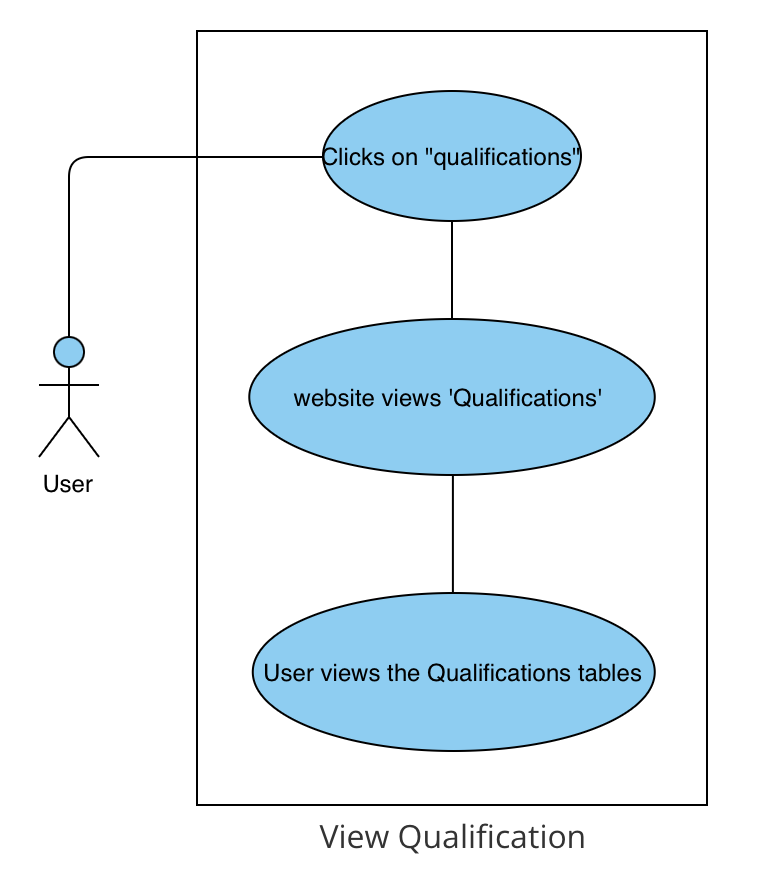
## 1. View Company Qualifications
|Testing Description|Test Scenarios|
|---|---|
| A tester makes sure they can view a new Worker under the Qualifications he has on the Qualification page.| The tester starts the server, and then the client. They open the website, than navigate to the Qualifications page. They then check the current qualifications of the Company. He navigates to the worker page, creates a new worker with 2 qualifications from the list, than navigates back to the qualification page and makes sure that new Worker's name appears under the 2 qualifications he choose for him.||

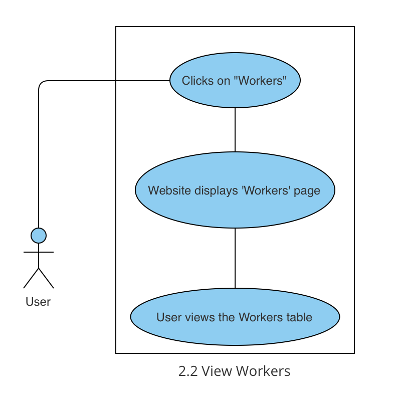
## 2. View Company Employed Workers
|Testing Description|Test Scenarios|
|---|---|
| A tester makes sure they can view the company's employed workers on the Workers page.|The tester starts the server, and then the client.  They open the Workers page.  They then check that the page displays each employed worker.  The tester also makes sure there's nothing on the page that should not be there, such as placeholder text.|

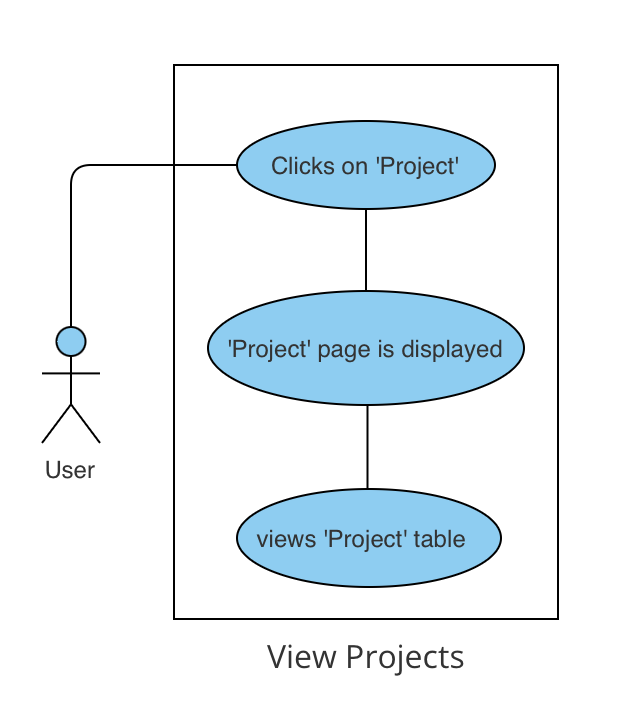
## 3. View Company Projects
|Testing Description|Test Scenarios|
|---|---|
| A tester makes sure they can view a new Project under the Project page.| The tester starts the server, and then the client. They open the website, than navigate to the Projects page. They then check the current list of Projects of the Company. He then creates a new project, with all the approriate data(name, workers, qualifications), and makes sure that new Project's name, workers and qualifications appear in the list/table of projects. The tester also makes sure there's nothing on the page that should not be there, such as placeholder text.|

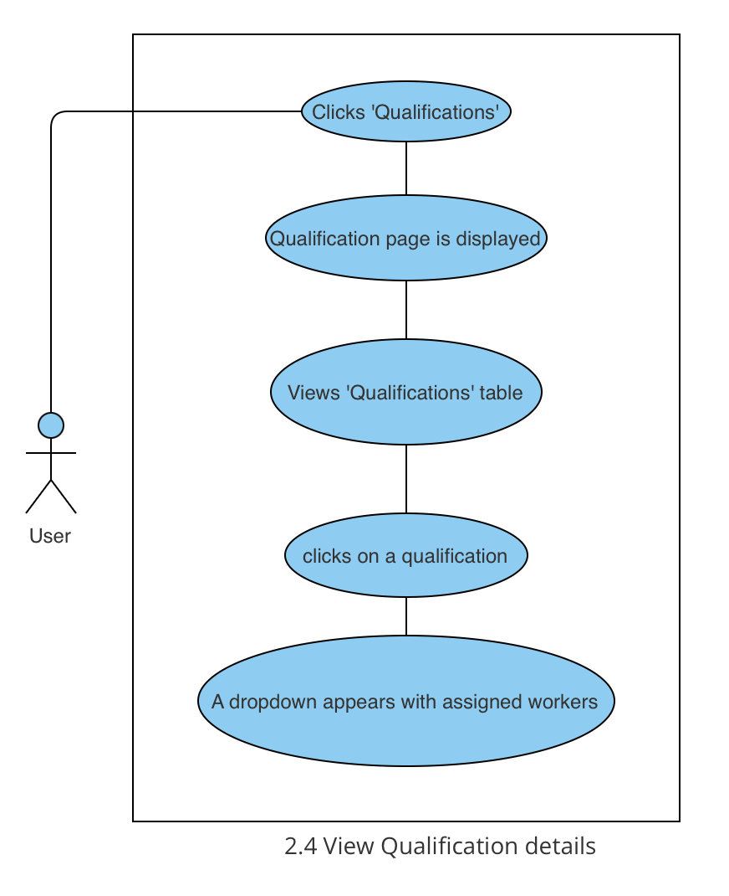
## 4. View Qualifications details
|Testing Description|Test Scenarios|
|---|---|
| A tester makes sure that they can view a new Qualifications under the Qualifications page. | The tester starts the server, and then the client. The Tester opens the website, and then navigate to the Qualifications page. The Tester then checks the current list of Qualifications of the Worker and that they have all required qualification. The Tester also checks and makes sure that there's nothing on the page that should not be there such as placeholder text.| 

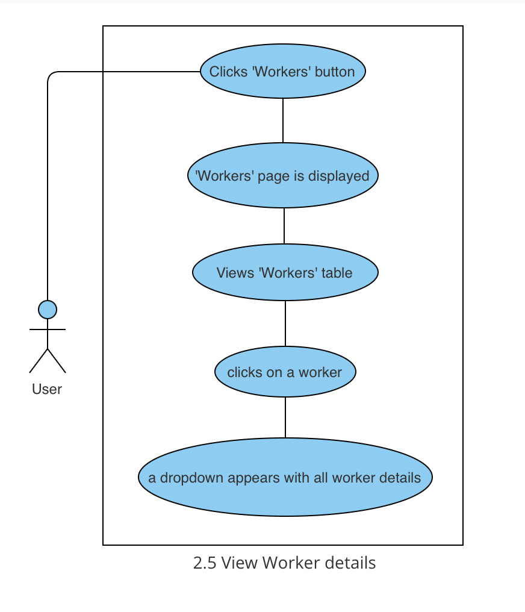
## 5. View  worker details
|Testing Description|Test Scenarios|
|---|---|
| A tester makes sure that they can view a new worker details under the Workers page. | The tester starts the server, and then the client. The Tester opens the website, and then navigate to the Workers page. The Tester then checks the current list of Workers and checks if that they have all workers and new workers are displayed along with their respective information like the Project assigned or Unassigned, and their salary details. The Tester also checks and makes sure that there's nothing on the page that should not be there such as placeholder text.| 

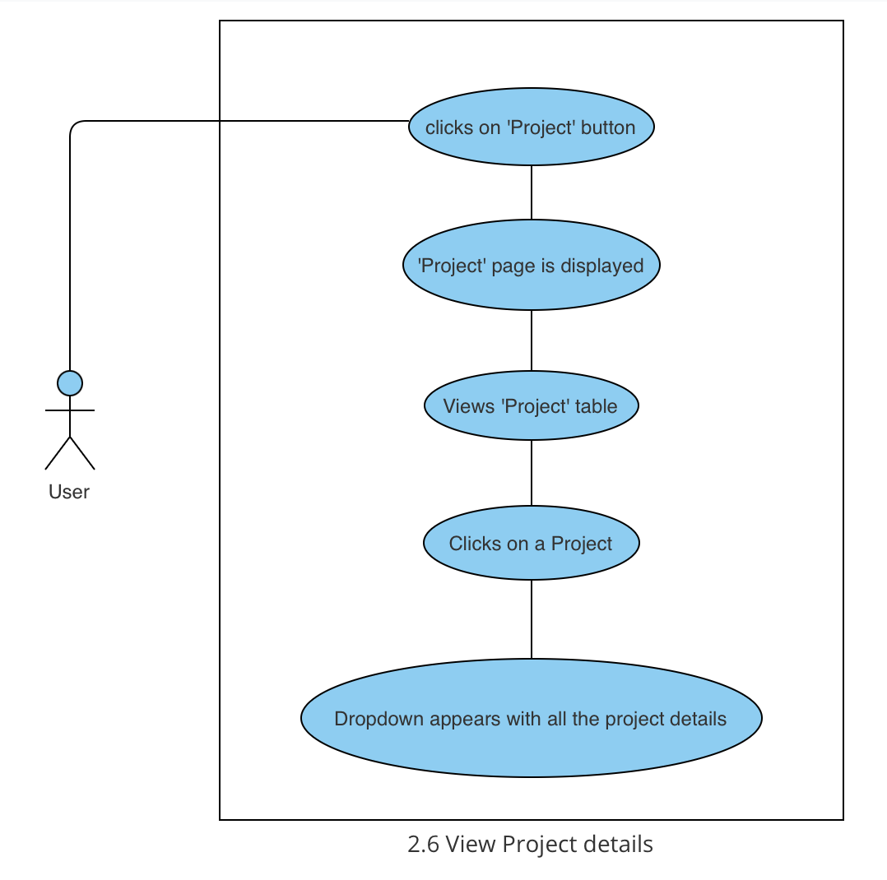
## 6. View  Project details
|Testing Description|Test Scenarios|
|---|---|
| A tester makes sure that they can view a new Project details under the Project page. | The tester starts the server, and then the client. The Tester opens the website, and then navigate to the Project page. The Tester then checks the current list of Project and checks if that they have all Project and new Project created are displayed along with their respective information like the detiles of workers assigned, qualifications requirred for the project. The Tester also checks and makes sure that there's nothing on the page that should not be there such as placeholder text.|

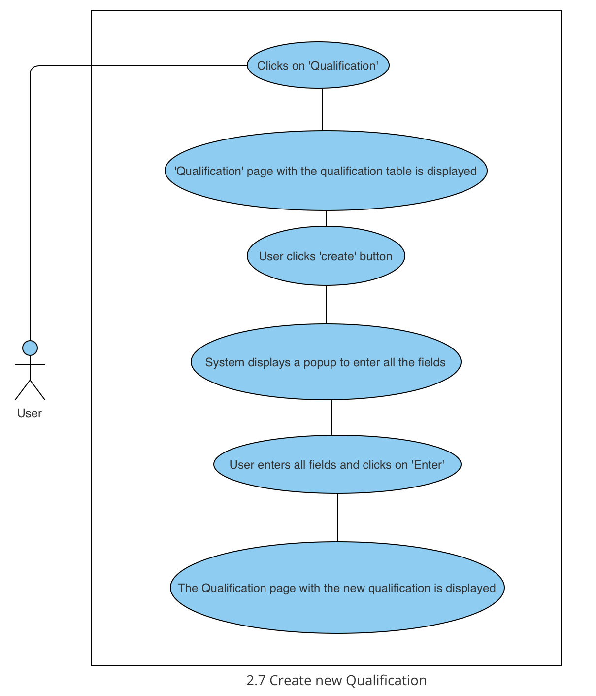
## 7. Create New Qualification 
|Testing Description|Test Scenarios|
|---|---|
| A tester makes sure that they can create a new Qualification under the Qualification page. | The tester starts the server, and then the client. The Tester opens the website, and then navigate to the Qualification page. The Tester then clicks on the add Qualification button. They then insert into the tabs the Qualification description with description "Web Development". He then clicks add, then page refreshes and he makes sure that the new Qualification is under the list of Qualifications in the Qualifications Tab. Then they try to create another qualifcation with description equal to the empty string. They then verify this Qualification was not created and does not exist under the list of qualifications in the qualifications tab.| 

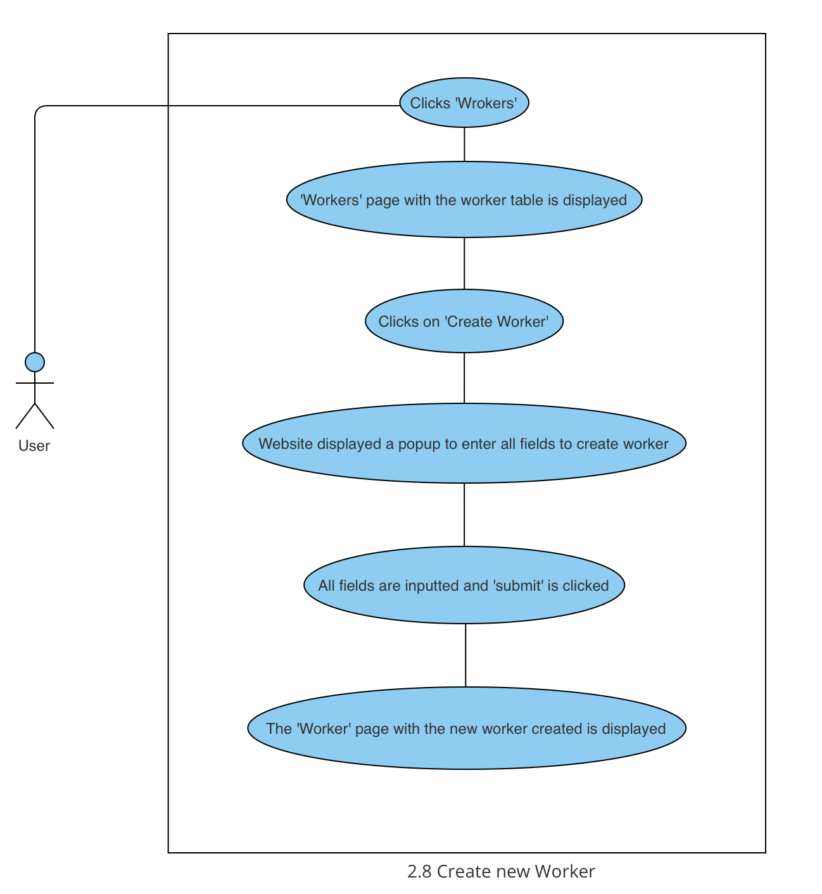
## 8. Create Worker Details
|Testing Description|Test Scenarios|
|---|---|
| A tester makes sure that they can create a new Worker under the Worker page. | The tester starts the server, and then the client. The Tester opens the website, and then navigate to the Worker page. The Tester then clicks on the add Worker button they then insert into the tabs the name of the worker, his salary and the Qualifications. He then clicks add, then page refreshes and he makes sure that the new Worker is under the list of Workers in the Worker Tab.| 

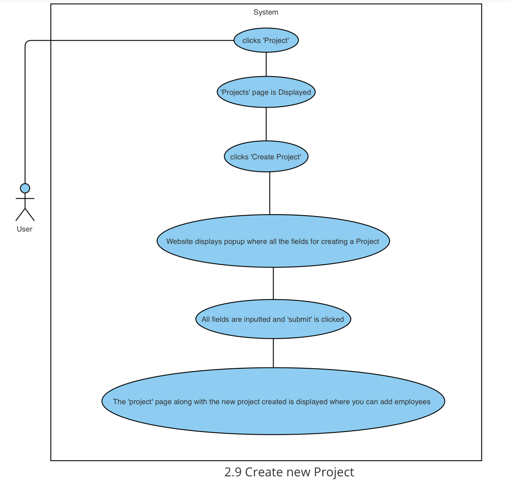
## 9. Create New Project
|Testing Description|Test Scenarios|
|---|---|
| A tester makes sure that they can create a new project in the project page. | The tester starts the server, and then the client. The Tester opens the website, and then navigate to the Project page. The Tester then clicks the '+' button to create a new project and fills in the required fields with valid entries, such as name="go to mars", Status="ACTIVE", Size="BIG", Qualifications="Astronaut" and assign workers. He then clicks add, then page refreshes and he makes sure that the new project is under the list of projects in the projects Tab. Then they try to create another project with the name equal to the empty string. They then verify this project was not created and does not exist under the list of projects in the projects tab.| 

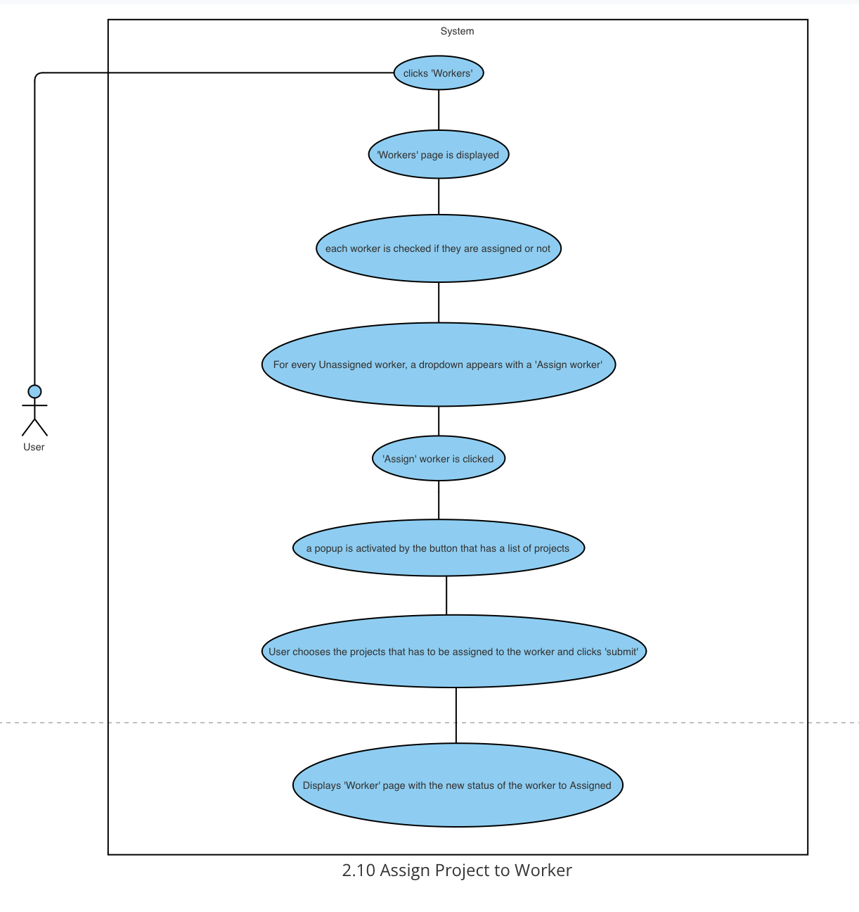
## 10. Assign Worker
|Testing Description|Test Scenarios|
|---|---|
| A tester makes sure that they can assign a worker to a project in the project page. | The tester starts the server, and then the client. The Tester opens the website, and then navigates to the Project page. The Tester then clicks on any of the Projects that are Planned or Suspended and one that still needs a qualification. He then clicks any of the workers on the list that match the qualifications required. Once one of the workers are selected, the tester clicks on the submit button and the page will refresh with the worker now in the list of Project's workers. The tester must make sure the qualification that was required is not required anymore. Furthermore the tester has to navigate to the Worker page and check if the worker added to the Project has the Project in his list of projects.| 

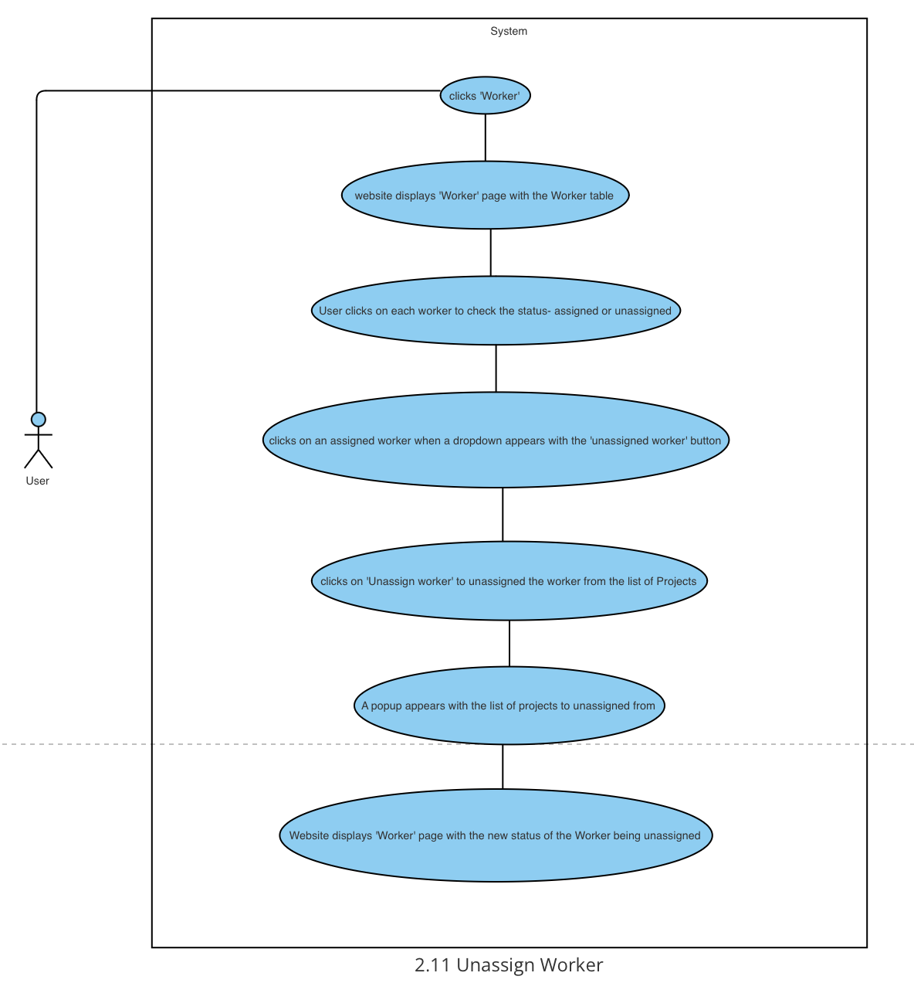
## 11. Assign Worker
|Testing Description|Test Scenarios|
|---|---|
| A tester makes sure that they can unassign a worker from a project in the project page. | The tester starts the server, and then the client. The Tester opens the website, and then navigates to the Worker page. The Tester then clicks on any of the Workers that are in a project. Then they choose a project in the workers list of projects and clicks the button "unassign". Once clicked the page will refresh and the tester must make sure that the project is not in the Worker's list of Projects. Furthermore the tester has to navigate to the Project page and check if the project that the Worker was unnassigned from doesn't have the Worker in it's list of Workers| 

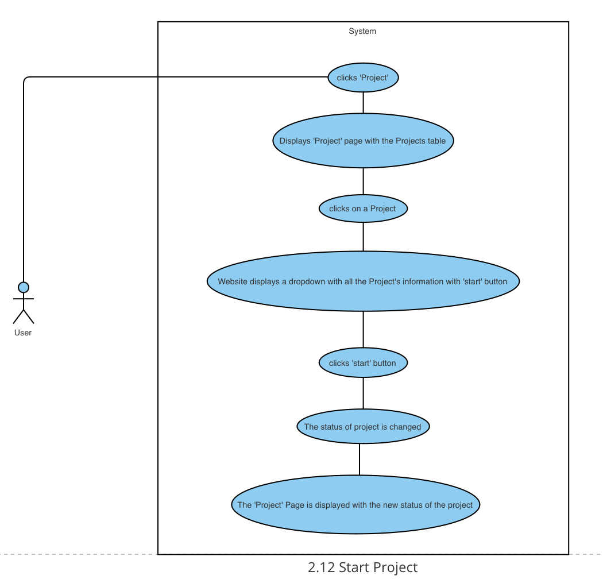
## 12. Start Project
|Testing Description|Test Scenarios|
|---|---|
| A tester makes sure that they can Start a Project in the project page. | The tester starts the server, and then the client. The Tester opens the website, and then navigates to the Project page. The Tester then clicks on any of the Projects that are 'PLANNED' and don't need anymore qualifications required. Then they click on the button 'Active' which should set the Project to Active. The tester makes sure that no workers can be assigned to the project anymore and that the project says 'ACTIVE'.| 

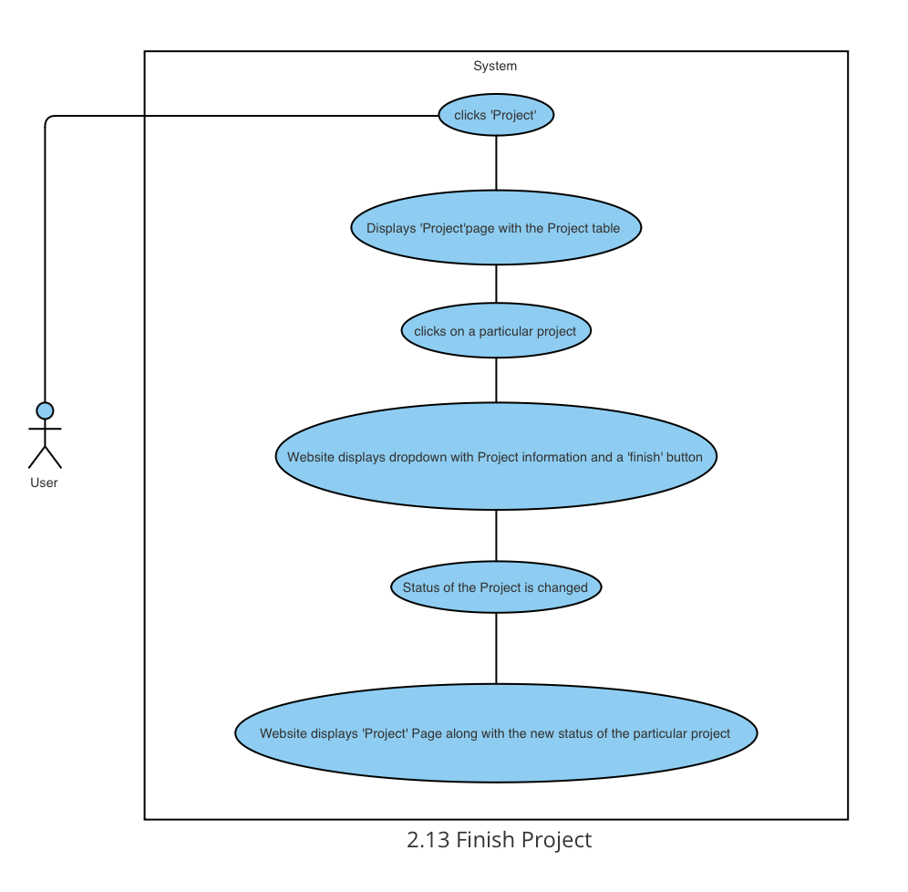
## 13. Finish Project
|Testing Description|Test Scenarios|
|---|---|
| A tester makes sure that they can Finish a Project in the project page. | The tester starts the server, and then the client. The Tester opens the website, and then navigates to the Project page. The Tester then clicks on any of the Projects that are 'ACTIVE'. Then they click on the button 'Finish' which should set the Project to 'FINISHED'. The tester makes sure that workers can now be unassigned/assigned to the project and that the project says 'FINISHED'.| 

